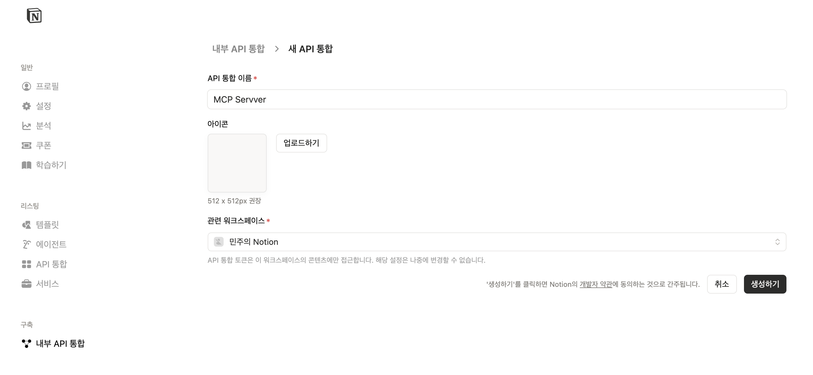
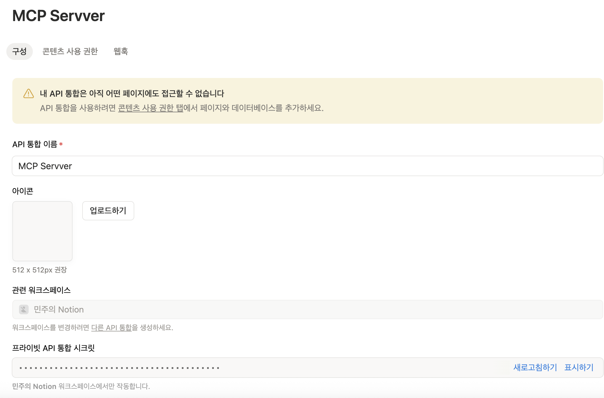
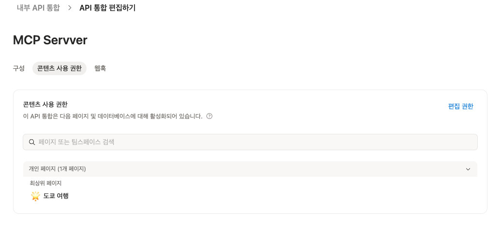
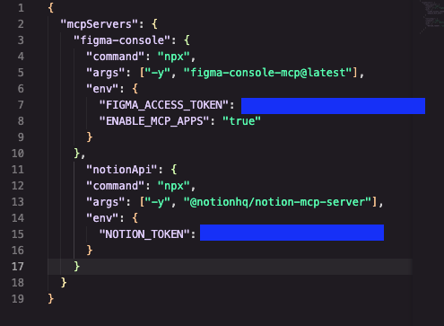

# 🛠️ 사전 설치 가이드
---

## 📋 설치 체크리스트

완료 시 ✅ 체크해주세요:

- [ ] **Step 0** — Node.js 설치
- [ ] **Step 1** — Kiro IDE 설치 및 로그인
- [ ] **Step 2** — Figma Personal Access Token 발급
- [ ] **Step 3** — Figma Console MCP 설정 (Kiro IDE)
- [ ] **Step 4** — Figma Desktop Bridge 플러그인 설치
- [ ] **Step 5** — Notion MCP 연결 (Kiro IDE)
- [ ] **Step 6** — 전체 동작 확인

---

## Step 0. Node.js 설치 (5분)

Figma Console MCP 실행에 Node.js 18 이상이 필요합니다.

### 이미 설치되어 있는지 확인

터미널(맥) 또는 명령 프롬프트(윈도우)를 열고:

```bash
node --version
```

`v18.x.x` 이상이 나오면 → **Step 1로 건너뛰세요!**

### 설치가 안 되어 있다면

1. https://nodejs.org 접속
2. **LTS** 버전 다운로드 (초록색 버튼)
3. 설치 파일 실행 → 기본 옵션으로 Next 클릭
4. 설치 완료 후 터미널을 **새로 열고** 다시 확인:

```bash
node --version
# v20.x.x 또는 v22.x.x 등이 나오면 성공!
```
  
---

## Step 1. Kiro IDE 설치 및 로그인 (5분)

### 1-1. 다운로드

1. https://kiro.dev/downloads 접속

2. 본인 OS에 맞는 설치 파일 다운로드
   - **macOS:** `.dmg` 파일
   - **Windows:** `.exe` 파일
   

### 1-2. 설치

- **macOS:** `.dmg` 열고 → Kiro 아이콘을 Applications 폴더로 드래그
- **Windows:** `.exe` 실행 → 설치 마법사 따라 진행

### 1-3. 첫 실행 및 로그인

1. Kiro IDE 실행
2. 로그인 화면에서 원하는 방식으로 로그인 (Google, GitHub, AWS 등)

3. 아래와 같은 화면이 나오면 성공!


---

## Step 2. Figma Personal Access Token 발급 (2분)

> ⚠️ Figma Desktop이 이미 설치되어 있다는 전제로 진행합니다.

1. Figma Desktop 또는 아래 웹사이트 접속:  
  👉 https://www.figma.com/
  
    Account -> Settings -> Security -> **Personal access tokens** -> **Generate new token**
   
   

2. Token 설명 입력: `Kiro Workshop`
3. expiration : 90days
3. **Scope 설정** (중요!): 전체 선택

    
4. **Generate token** 클릭

5. ⚠️ **토큰을 즉시 복사해서 안전한 곳에 저장!** (다시 볼 수 없습니다)
   - 토큰은 `figd_` 로 시작합니다
   - 메모장이나 노트에 임시 저장해두세요

---

## Step 3. Figma Console MCP 설정 — Kiro IDE (3분)

Kiro IDE에서 Figma Console MCP를 연결합니다.

### 3-1. MCP 설정 파일 열기

1. Kiro IDE 실행 합니다. 
2. File > Open Folder로 빈 폴더를 생성하여 엽니다. (예: `igaworks-intro`)
3. 사이드바에서 Kiro 아이콘 클릭 > MCP SERVERS 

### 3-2. 설정 입력

열린 JSON 파일에 아래 내용을 붙여넣기:

```json
{
  "mcpServers": {
    "figma-console": {
      "command": "npx",
      "args": ["-y", "figma-console-mcp@latest"],
      "env": {
        "FIGMA_ACCESS_TOKEN": "figd_여기에_본인_토큰_붙여넣기",
        "ENABLE_MCP_APPS": "true"
      }
    }
  }
}
```

> ⚠️ `figd_여기에_본인_토큰_붙여넣기` 부분을 Step 2에서 복사한 실제 토큰으로 교체하세요!

5. 파일 저장 (`Cmd+S` / `Ctrl+S`)

### 3-3. 첫 실행 (자동 설치)

`Enable MCP` 버튼 클릭 후 MCP 활성화 되었는지 확인하기
(처음 실행 시 1~2분 정도 걸릴 수 있습니다.)


---

## Step 4. Figma Desktop Bridge 플러그인 설치 (3분)

이 플러그인이 Figma Desktop과 Kiro IDE를 실시간으로 연결해줍니다.

### 4-1. 플러그인 파일 경로 확인

터미널에서 실행:

```bash
npx figma-console-mcp@latest --print-path
```

출력된 경로를 메모해두세요. 보통 아래와 같습니다:
- **macOS:** `~/.figma-console-mcp/plugin/manifest.json`
- **Windows:** `C:\Users\사용자명\.figma-console-mcp\plugin\manifest.json`


> 💡 위 명령이 안 되면, Kiro에서 MCP 서버가 한 번 실행된 후에 자동 생성됩니다.  
> Step 3 완료 후 Kiro를 재시작하면 파일이 생깁니다.

### 4-2. Figma Desktop에서 플러그인 가져오기

1. **Figma Desktop** 실행 (웹 버전 아님!)
2. 아무 디자인 파일 열기
3. 상단 메뉴: **Plugins** → **Development** → **Import plugin from manifest…**

4. 위에서 확인한 `manifest.json` 파일 선택 → **Open**


### 4-3. 플러그인 실행

1. **Plugins** → **Development** → **Figma Desktop Bridge** 클릭
2. 작은 상태 창이 나타나면 성공! 🎉
   - 🟢 초록색 = MCP 서버와 연결됨
   - 🔴 빨간색 = 아직 연결 안 됨 (Kiro IDE가 실행 중이어야 합니다)

    > 💡 **한 번만 설치하면 됩니다.** 이후 업데이트는 자동으로 처리됩니다.
3. 연결확인
    - 아래 프롬프트로 정상 연결 테스트 
    ```
    "Figma 상태 확인해줘" → WebSocket 연결 활성 상태 표시되어야 함
    "파란 배경의 간단한 프레임을 만들어줘" → Figma에 프레임이 생성되어야 함
    ```
    
    
    
---

## Step 5. Notion MCP 연결 (2분)

AI 클라이언트(Claude Code, Cursor 등)에서 Notion 페이지/데이터베이스를 직접 읽고 쓸 수 있게 해주는 MCP 서버.

### Step 1: Notion Integration 토큰 생성

1. [https://www.notion.so/profile/integrations](https://www.notion.so/profile/integrations) 접속
2. **"내부 API 통합"** 클릭

3. 이름 설정 (예: `MCP Server`)
4. 시크릿 토큰 복사 (`ntn_`으로 시작)

5. **컨텐츠 사용권한** 탭 또는 개별 페이지의 **연결(Connections)** 메뉴에서 해당 인테그레이션에 접근 권한 부여


> 중요: 인테그레이션에 접근 권한을 부여하지 않으면 아무 페이지도 읽을 수 없다.

### Step 2: Kiro IDE MCP 설정

`~/.kiro/settings/mcp.json` (글로벌 설정) 또는 프로젝트 내 `.kiro/mcp.json`을 열고 아래 내용을 추가한다:

```json
{
  "mcpServers": {
    "notionApi": {
      "command": "npx",
      "args": ["-y", "@notionhq/notion-mcp-server"],
      "env": {
        "NOTION_TOKEN": "ntn_YOUR_TOKEN_HERE"
      }
    }
  }
}
```

> 이미 다른 MCP 서버(예: figma-console)가 설정되어 있다면, `mcpServers` 안에 `"notionApi": { ... }`를 나란히 추가하면 된다.

### Step 3: 연결 확인

Kiro IDE를 재시작한 후, 채팅창에 아래 프롬프트를 입력하여 연결을 테스트한다:

```
Notion에서 내 페이지 목록을 보여줘
```

> 페이지가 안 보이면 Notion에서 해당 페이지에 인테그레이션 연결을 추가했는지 확인한다. 페이지 우측 상단 `···` → **연결(Connections)** → 인테그레이션 추가.
---
