# 🛠️ 사전 설치 가이드
---

## 📋 설치 체크리스트

완료 시 ✅ 체크해주세요:

- [ ] **Step 0** — Node.js 설치
- [ ] **Step 1** — Kiro IDE 설치 및 로그인
- [ ] **Step 2** — Figma Personal Access Token 발급
- [ ] **Step 3** — Figma Console MCP 설정 (Kiro IDE)
- [ ] **Step 4** — Figma Desktop Bridge 플러그인 설치
- [ ] **Step 5** — Notion MCP 연결 (Kiro IDE)
- [ ] **Step 6** — 전체 동작 확인

---

## Step 0. Node.js 설치 (5분)

Figma Console MCP 실행에 Node.js 18 이상이 필요합니다.

### 이미 설치되어 있는지 확인

터미널(맥) 또는 명령 프롬프트(윈도우)를 열고:

```bash
node --version
```

`v18.x.x` 이상이 나오면 → **Step 1로 건너뛰세요!**

### 설치가 안 되어 있다면

1. https://nodejs.org 접속
2. **LTS** 버전 다운로드 (초록색 버튼)
3. 설치 파일 실행 → 기본 옵션으로 Next 클릭
4. 설치 완료 후 터미널을 **새로 열고** 다시 확인:

```bash
node --version
# v20.x.x 또는 v22.x.x 등이 나오면 성공!
```
  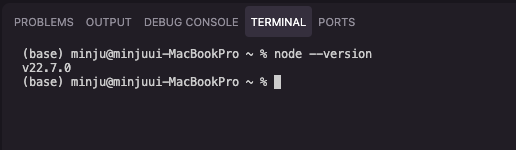
---

## Step 1. Kiro IDE 설치 및 로그인 (5분)

### 1-1. 다운로드

1. https://kiro.dev/downloads 접속
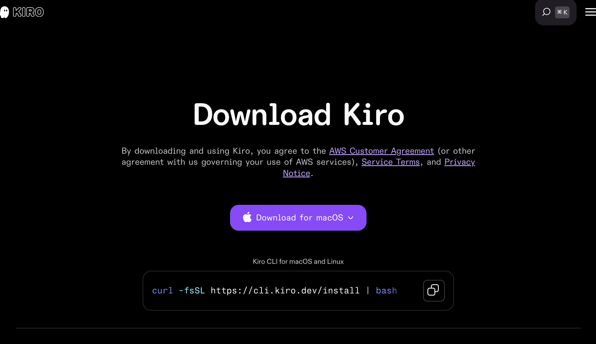
2. 본인 OS에 맞는 설치 파일 다운로드
   - **macOS:** `.dmg` 파일
   - **Windows:** `.exe` 파일
   

### 1-2. 설치

- **macOS:** `.dmg` 열고 → Kiro 아이콘을 Applications 폴더로 드래그
- **Windows:** `.exe` 실행 → 설치 마법사 따라 진행

### 1-3. 첫 실행 및 로그인

1. Kiro IDE 실행
2. 로그인 화면에서 원하는 방식으로 로그인 (Google, GitHub, AWS 등)
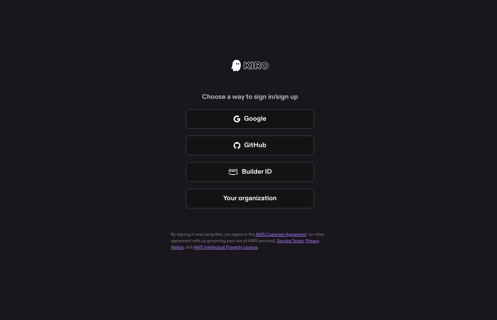
3. 아래와 같은 화면이 나오면 성공!
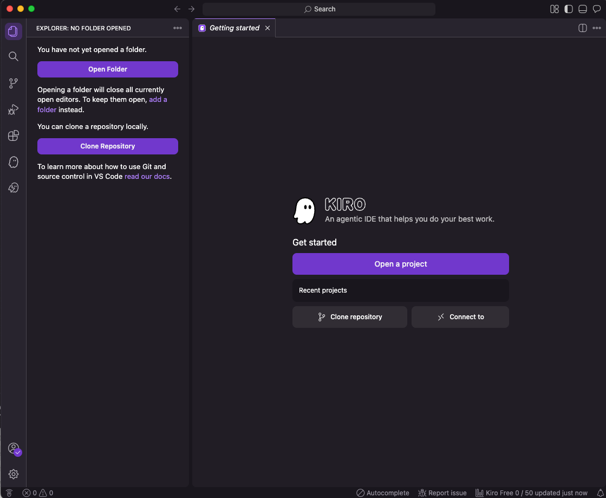

---

## Step 2. Figma Personal Access Token 발급 (2분)

> ⚠️ Figma Desktop이 이미 설치되어 있다는 전제로 진행합니다.

1. Figma Desktop 또는 아래 웹사이트 접속:  
  👉 https://www.figma.com/
  
    Account -> Settings -> Security -> **Personal access tokens** -> **Generate new token**
   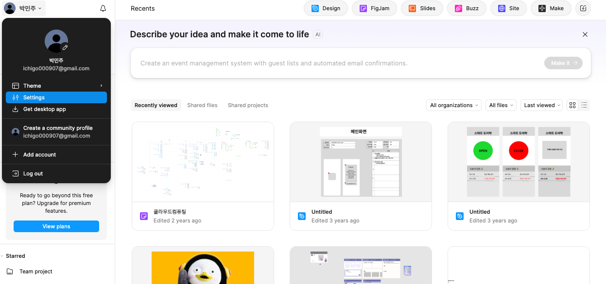
   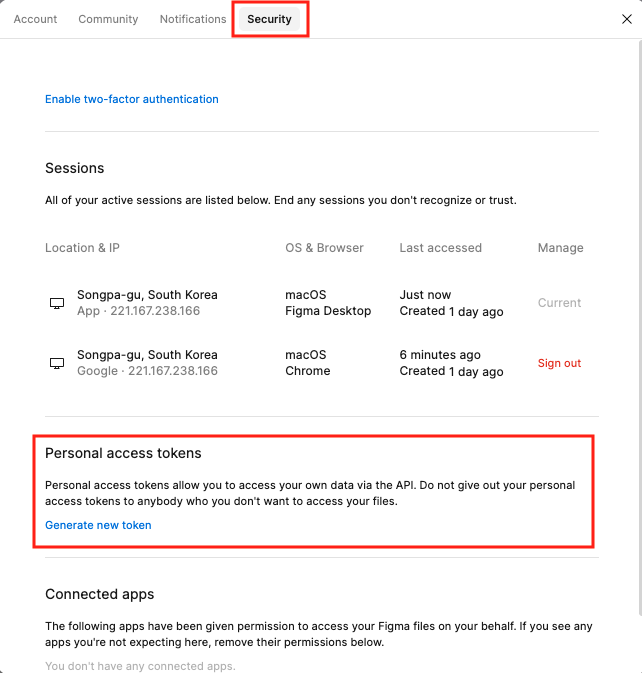

2. Token 설명 입력: `Kiro Workshop`
3. expiration : 90days
3. **Scope 설정** (중요!): 전체 선택
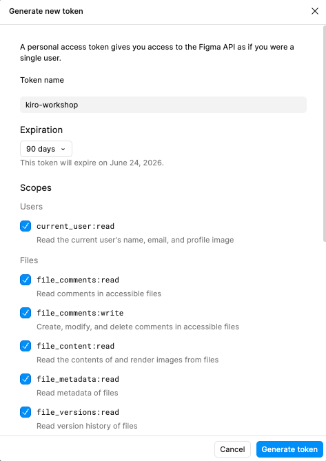
4. **Generate token** 클릭

5. ⚠️ **토큰을 즉시 복사해서 안전한 곳에 저장!** (다시 볼 수 없습니다)
   - 토큰은 `figd_` 로 시작합니다
   - 메모장이나 노트에 임시 저장해두세요

---

## Step 3. Figma Console MCP 설정 — Kiro IDE (3분)

Kiro IDE에서 Figma Console MCP를 연결합니다.

### 3-1. MCP 설정 파일 열기

1. Kiro IDE 실행 합니다. 
2. File > Open Folder로 빈 폴더를 생성하여 엽니다. (예: `igaworks-intro`)
3. 사이드바에서 Kiro 아이콘 클릭 > MCP SERVERS 
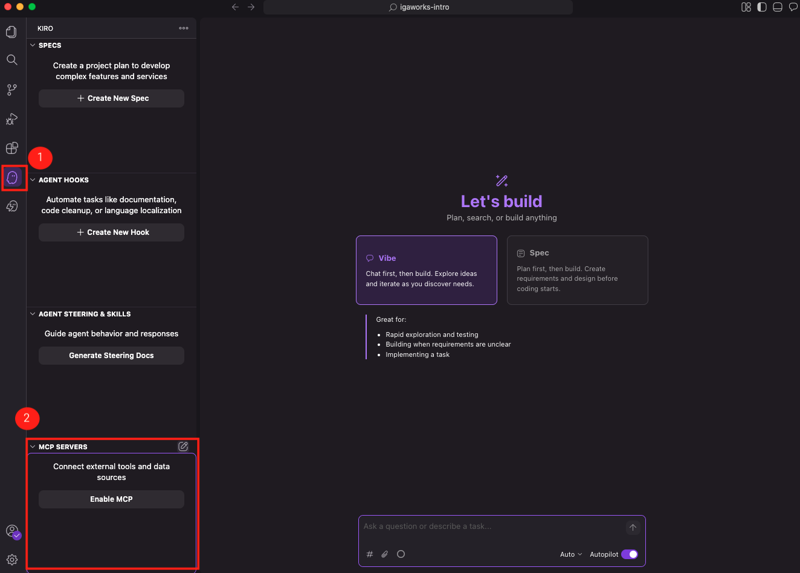
### 3-2. 설정 입력

열린 JSON 파일에 아래 내용을 붙여넣기:

```json
{
  "mcpServers": {
    "figma-console": {
      "command": "npx",
      "args": ["-y", "figma-console-mcp@latest"],
      "env": {
        "FIGMA_ACCESS_TOKEN": "figd_여기에_본인_토큰_붙여넣기",
        "ENABLE_MCP_APPS": "true"
      }
    }
  }
}
```

> ⚠️ `figd_여기에_본인_토큰_붙여넣기` 부분을 Step 2에서 복사한 실제 토큰으로 교체하세요!

5. 파일 저장 (`Cmd+S` / `Ctrl+S`)

### 3-3. 첫 실행 (자동 설치)

`Enable MCP` 버튼 클릭 후 MCP 활성화 되었는지 확인하기
(처음 실행 시 1~2분 정도 걸릴 수 있습니다.)
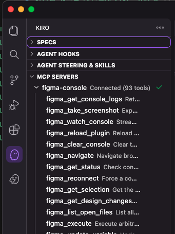

---

## Step 4. Figma Desktop Bridge 플러그인 설치 (3분)

이 플러그인이 Figma Desktop과 Kiro IDE를 실시간으로 연결해줍니다.

### 4-1. 플러그인 파일 경로 확인

터미널에서 실행:

```bash
npx figma-console-mcp@latest --print-path
```

출력된 경로를 메모해두세요. 보통 아래와 같습니다:
- **macOS:** `~/.figma-console-mcp/plugin/manifest.json`
- **Windows:** `C:\Users\사용자명\.figma-console-mcp\plugin\manifest.json`

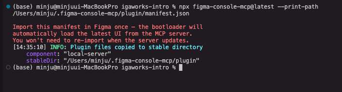
> 💡 위 명령이 안 되면, Kiro에서 MCP 서버가 한 번 실행된 후에 자동 생성됩니다.  
> Step 3 완료 후 Kiro를 재시작하면 파일이 생깁니다.

### 4-2. Figma Desktop에서 플러그인 가져오기

1. **Figma Desktop** 실행 (웹 버전 아님!)
2. 아무 디자인 파일 열기
3. 상단 메뉴: **Plugins** → **Development** → **Import plugin from manifest…**
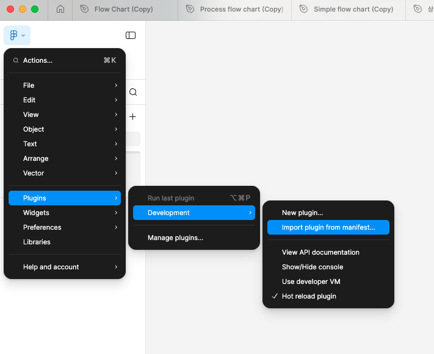
4. 위에서 확인한 `manifest.json` 파일 선택 → **Open**
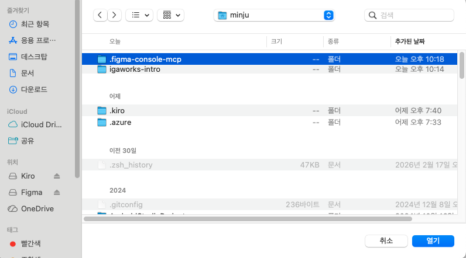
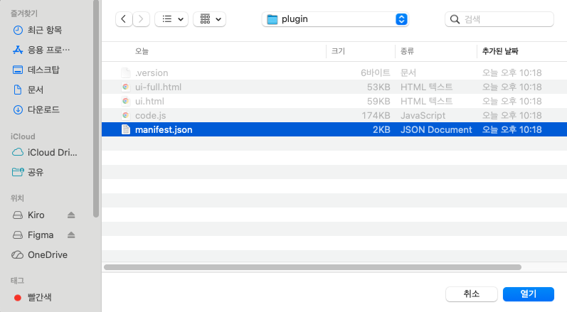


### 4-3. 플러그인 실행

1. **Plugins** → **Development** → **Figma Desktop Bridge** 클릭
2. 작은 상태 창이 나타나면 성공! 🎉
   - 🟢 초록색 = MCP 서버와 연결됨
   - 🔴 빨간색 = 아직 연결 안 됨 (Kiro IDE가 실행 중이어야 합니다)
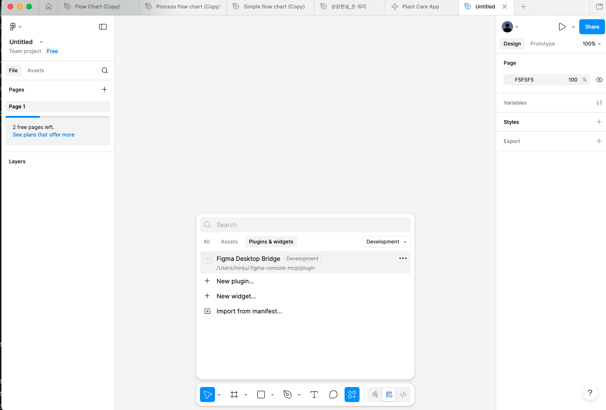
    > 💡 **한 번만 설치하면 됩니다.** 이후 업데이트는 자동으로 처리됩니다.
3. 연결확인
    - 아래 프롬프트로 정상 연결 테스트 
    ```
    "Figma 상태 확인해줘" → WebSocket 연결 활성 상태 표시되어야 함
    "파란 배경의 간단한 프레임을 만들어줘" → Figma에 프레임이 생성되어야 함
    ```
    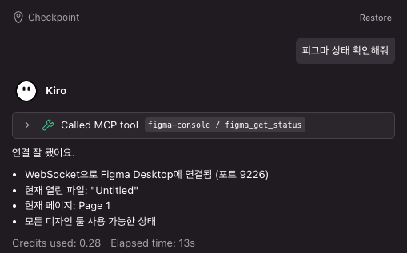
    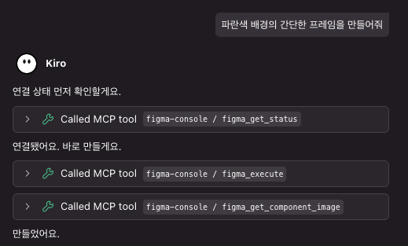
    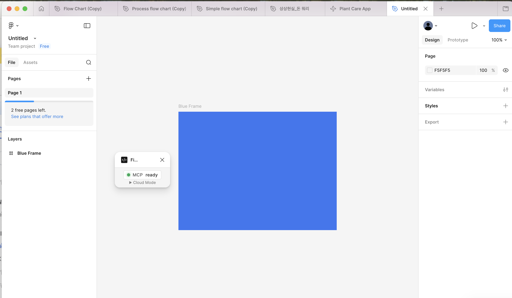
---

## Step 5. Notion MCP 연결 (2분)

### 5-1. MCP 설정에 Notion 추가

Step 3에서 열었던 MCP 설정 파일을 다시 열고, Notion 서버를 추가합니다:

```json
{
  "mcpServers": {
    "figma-console": {
      "command": "npx",
      "args": ["-y", "figma-console-mcp@latest"],
      "env": {
        "FIGMA_ACCESS_TOKEN": "figd_여기에_본인_토큰_붙여넣기",
        "ENABLE_MCP_APPS": "true"
      }
    },
    "notion": {
      "command": "npx",
      "args": ["-y", "mcp-remote", "https://mcp.notion.com/mcp"]
    }
  }
}
```

> 💡 Notion은 OAuth 인증 방식이라 별도 토큰이 필요 없습니다!

### 5-2. OAuth 인증

1. 파일 저장 후 Kiro IDE 재시작
2. Kiro 채팅에서 Notion 관련 질문을 하면 (예: "Notion에서 페이지 검색해줘")
3. 브라우저가 열리며 Notion 로그인/권한 허용 화면이 나옵니다
4. **Allow access** 클릭 → 연결 완료! 🎉

---

## Step 6. 전체 동작 확인 (5분)

모든 설치가 끝났으면 아래를 확인해주세요.

### ✅ 확인 1: Kiro IDE 정상 실행

- Kiro IDE를 열고 로그인 상태인지 확인

### ✅ 확인 2: Figma 연결 테스트

1. **Figma Desktop**에서 아무 파일 열기
2. **Plugins** → **Development** → **Figma Desktop Bridge** 실행
3. Kiro IDE 채팅창에 입력:

```
Check Figma status
```

→ 연결 상태가 표시되면 성공!

### ✅ 확인 3: Notion 연결 테스트

Kiro IDE 채팅창에 입력:

```
Notion에서 최근 페이지 검색해줘
```

→ OAuth 인증 후 Notion 데이터가 나오면 성공!

---

## 🚨 트러블슈팅

| 증상 | 해결 방법 |
|------|-----------|
| `node --version` 안 됨 | Node.js 설치 후 터미널을 **새로 열기** |
| Figma 토큰이 `figd_`로 시작 안 함 | 토큰을 다시 생성해주세요 |
| "Failed to connect to Figma Desktop" | Figma Desktop Bridge 플러그인이 실행 중인지 확인 |
| MCP 서버가 안 뜸 | Kiro IDE를 완전히 종료 후 재시작 |
| `manifest.json` 파일이 없음 | 터미널에서 `npx figma-console-mcp@latest` 한 번 실행 |
| Notion OAuth 창이 안 뜸 | Kiro 재시작 후 다시 시도 |
| JSON 설정 오류 | https://jsonlint.com 에서 JSON 문법 확인 |

---

## 📌 워크샵 당일 준비물

1. ✅ **Kiro IDE** — 로그인 완료 상태
2. ✅ **Figma Desktop** — 로그인 + Bridge 플러그인 설치 완료
3. ✅ **Notion** — 로그인 완료
4. ✅ **안정적인 인터넷 연결**

> 설치 중 문제가 있으시면 워크샵 전에 미리 연락주세요!  
> 당일에는 설치 시간 없이 바로 실습으로 진행합니다. 🚀
